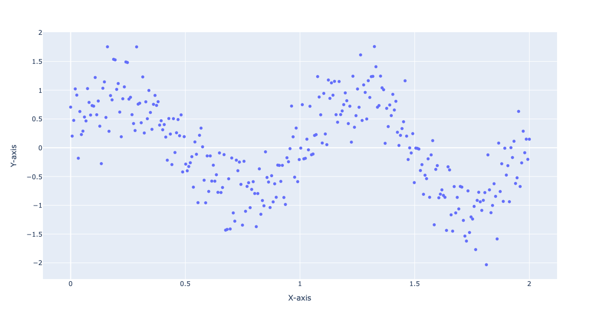
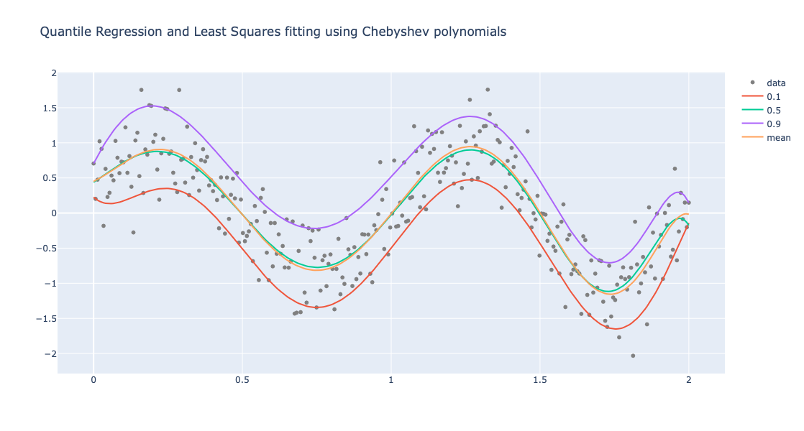
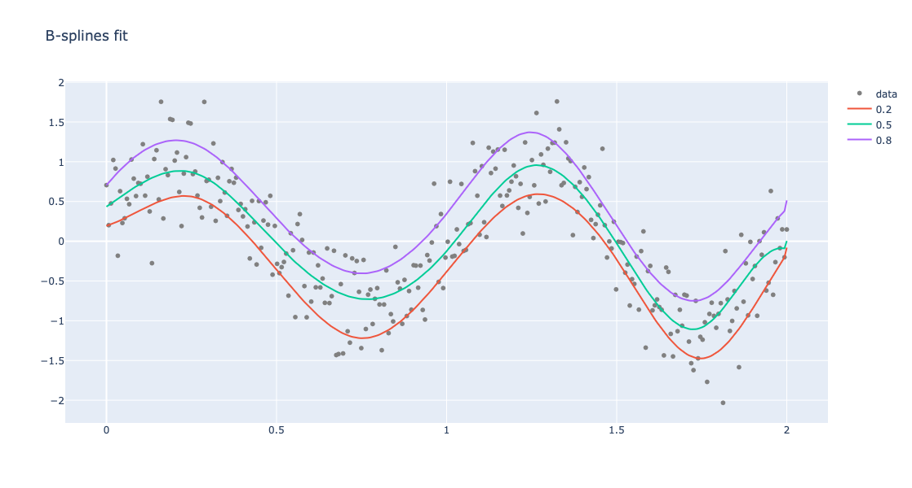
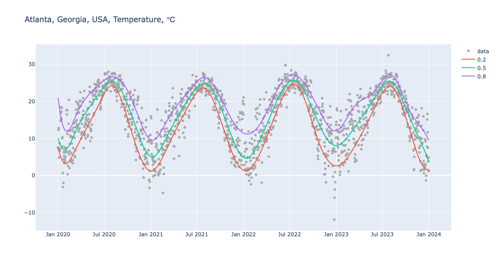
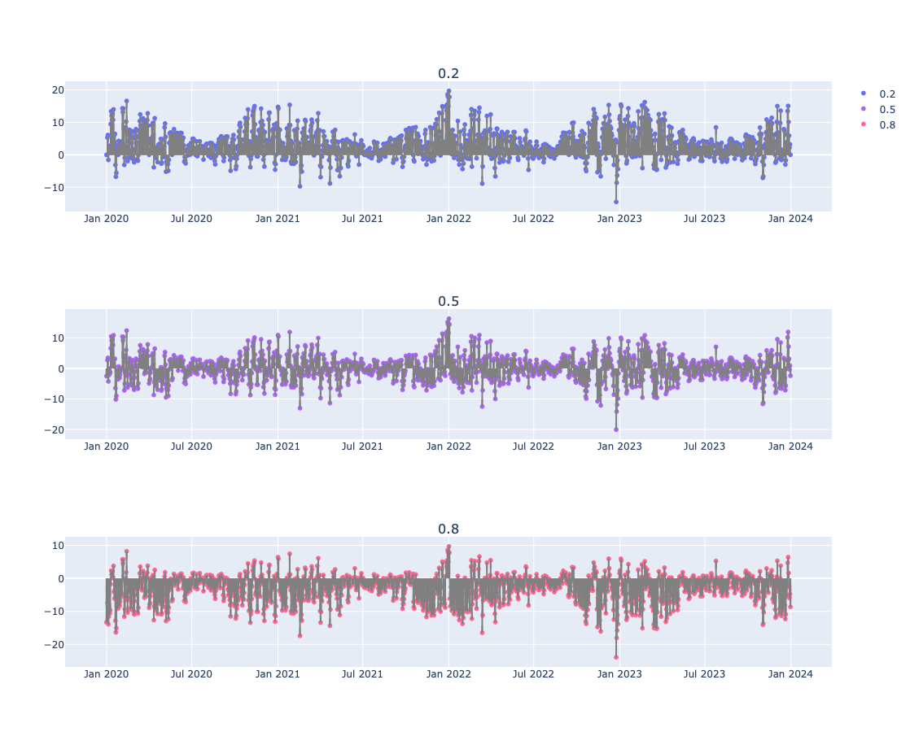
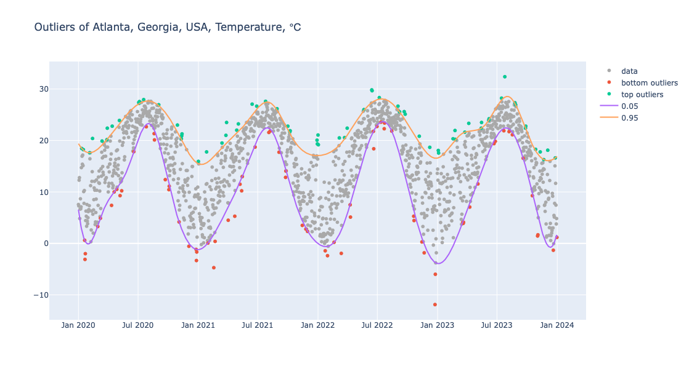
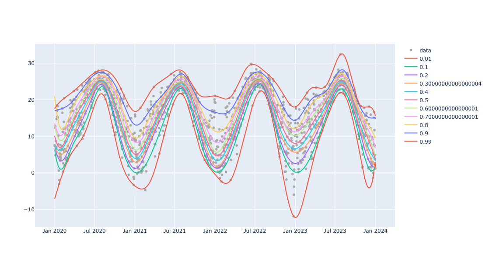
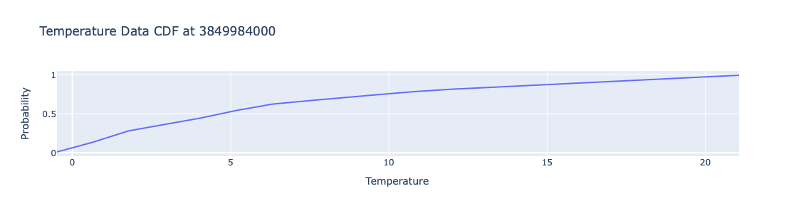
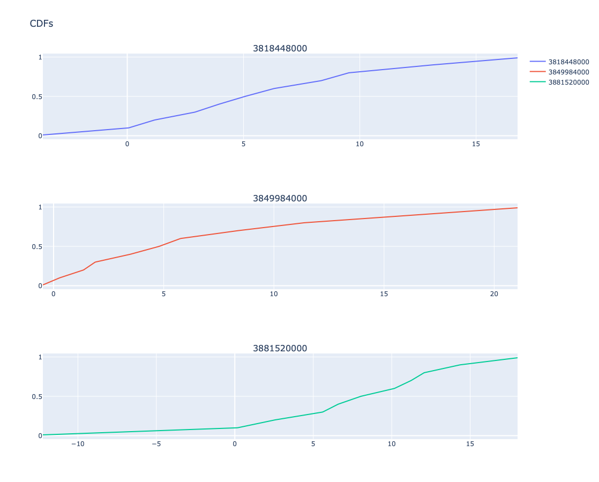

# Regressionizer demo

###  *Rapid specification of regression workflows*

Anton Antonov    
[PythonForPrediction at WordPress](https://pythonforprediction.wordpress.com)   
August 2024

-------

## Setup

Load the "Regressionizer" and other "standard" packages:


```python
from Regressionizer import *

import numpy as np
import plotly.express as px
import plotly.graph_objects as go
```


```python
template='plotly'
```

-------

## Generate input data

Generate random data:


```python
np.random.seed(0)
x = np.linspace(0, 2, 300)
y = np.sin(2 * np.pi * x) + np.random.normal(0, 0.4, x.shape)
data = np.column_stack((x, y))
```

Plot the generated data:


```python
fig = px.scatter(x=data[:, 0], y=data[:, 1], labels={'x': 'X-axis', 'y': 'Y-axis'}, template=template, width = 800, height = 600)
fig.show()
```



------

## Fit given functions

Define a list of functions:


```python
funcs = [lambda x: 1, lambda x: x, lambda x: np.cos(x), lambda x: np.cos(3 * x), lambda x: np.cos(6 * x)]
```


```python
def chebyshev_t_polynomials(n):
    if n == 0:
        return lambda x: 1
    elif n == 1:
        return lambda x: x
    else:
        T0 = lambda x: 1
        T1 = lambda x: x
        for i in range(2, n + 1):
            Tn = lambda x, T0=T0, T1=T1: 2 * x * T1(x) - T0(x)
            T0, T1 = T1, Tn
        return Tn

chebyshev_polynomials = [chebyshev_t_polynomials(i) for i in range(10)]
```

Define ***regression quantile*** probabilities:


```python
probs = [0.1, 0.5, 0.9]
```

Perform Quantile Regression and (non-linear) Least Squares Fit:


```python
obj2 = (
    Regressionizer(data)
    .echo_data_summary()
    .quantile_regression_fit(funcs=chebyshev_polynomials, probs=probs)
    .least_squares_fit(funcs=chebyshev_polynomials)
    .plot(title = "Quantile Regression and Least Squares fitting using Chebyshev polynomials", template=template)
)
```

    Statistic    Regressor | Value
    ------------ --------------------
    min                 0.0 | -2.0324132316043735
    25%                 0.5 | -0.6063257640389526
    median              1.0 | -0.0042185202753221695
    75%                 1.5 | 0.6300535444986601
    max                 2.0 | 1.757964402499859


Plot the obtained regression quantilies and least squares fit:


```python
obj2.take_value().show()
```



-------

## Fit B-splines

Instead of coming-up with basis functions we can use B-spline basis:


```python
obj = Regressionizer(data).quantile_regression(knots=8, probs=[0.2, 0.5, 0.8]).plot(title="B-splines fit", template=template)
```

Show the obtained plot:


```python
obj.take_value().show()
```



Here is a dictionary of the found regression quantiles:


```python
obj.take_regression_quantiles()
```


    {0.2: <function QuantileRegression.QuantileRegression._make_combined_function.<locals>.<lambda>(x)>,
     0.5: <function QuantileRegression.QuantileRegression._make_combined_function.<locals>.<lambda>(x)>,
     0.8: <function QuantileRegression.QuantileRegression._make_combined_function.<locals>.<lambda>(x)>}


------

## Weather temperature data

Load weather data:


```python
import pandas as pd

url = "https://raw.githubusercontent.com/antononcube/MathematicaVsR/master/Data/MathematicaVsR-Data-Atlanta-GA-USA-Temperature.csv"
dfTemperature = pd.read_csv(url)
dfTemperature['DateObject'] = pd.to_datetime(dfTemperature['Date'], format='%Y-%m-%d')
dfTemperature = dfTemperature[(dfTemperature['DateObject'].dt.year >= 2020) & (dfTemperature['DateObject'].dt.year <= 2023)]
dfTemperature
```


<div>
<style scoped>
    .dataframe tbody tr th:only-of-type {
        vertical-align: middle;
    }

    .dataframe tbody tr th {
        vertical-align: top;
    }

    .dataframe thead th {
        text-align: right;
    }
</style>
<table border="1" class="dataframe">
  <thead>
    <tr style="text-align: right;">
      <th></th>
      <th>Date</th>
      <th>AbsoluteTime</th>
      <th>Temperature</th>
      <th>DateObject</th>
    </tr>
  </thead>
  <tbody>
    <tr>
      <th>2555</th>
      <td>2020-01-01</td>
      <td>3786825600</td>
      <td>7.56</td>
      <td>2020-01-01</td>
    </tr>
    <tr>
      <th>2556</th>
      <td>2020-01-02</td>
      <td>3786912000</td>
      <td>7.28</td>
      <td>2020-01-02</td>
    </tr>
    <tr>
      <th>2557</th>
      <td>2020-01-03</td>
      <td>3786998400</td>
      <td>12.28</td>
      <td>2020-01-03</td>
    </tr>
    <tr>
      <th>2558</th>
      <td>2020-01-04</td>
      <td>3787084800</td>
      <td>12.78</td>
      <td>2020-01-04</td>
    </tr>
    <tr>
      <th>2559</th>
      <td>2020-01-05</td>
      <td>3787171200</td>
      <td>4.83</td>
      <td>2020-01-05</td>
    </tr>
    <tr>
      <th>...</th>
      <td>...</td>
      <td>...</td>
      <td>...</td>
      <td>...</td>
    </tr>
    <tr>
      <th>4011</th>
      <td>2023-12-27</td>
      <td>3912624000</td>
      <td>11.67</td>
      <td>2023-12-27</td>
    </tr>
    <tr>
      <th>4012</th>
      <td>2023-12-28</td>
      <td>3912710400</td>
      <td>7.44</td>
      <td>2023-12-28</td>
    </tr>
    <tr>
      <th>4013</th>
      <td>2023-12-29</td>
      <td>3912796800</td>
      <td>3.78</td>
      <td>2023-12-29</td>
    </tr>
    <tr>
      <th>4014</th>
      <td>2023-12-30</td>
      <td>3912883200</td>
      <td>4.83</td>
      <td>2023-12-30</td>
    </tr>
    <tr>
      <th>4015</th>
      <td>2023-12-31</td>
      <td>3912969600</td>
      <td>1.17</td>
      <td>2023-12-31</td>
    </tr>
  </tbody>
</table>
<p>1461 rows × 4 columns</p>
</div>


Convert to "numpy" array: 


```python
temp_data = dfTemperature[['AbsoluteTime', 'Temperature']].to_numpy()
temp_data.shape
```


    (1461, 2)


Here is pipeline for Quantile Regression computation and making of a corresponding plot:


```python
obj = (
    Regressionizer(temp_data)
    .echo_data_summary()
    .quantile_regression(knots=20, probs=[0.2, 0.5, 0.8])
    .date_list_plot(title="Atlanta, Georgia, USA, Temperature, ℃", template=template, data_color="darkgray", width = 1200)
)
```

    Statistic    Regressor | Value
    ------------ --------------------
    min          3786825600.0 |     -11.89
    25%          3818361600.0 |      10.06
    median       3849897600.0 |      16.94
    75%          3881433600.0 |      22.56
    max          3912969600.0 |      32.39


Show the obtained plot:


```python
obj.take_value().show()
```



-------

## Fitting errors

### Errors

Here the absolute fitting errors are computed and the average is for each is computed:


```python
{ k : np.mean(np.array(d)[:,1]) for k, d in obj.errors(relative_errors=False).take_value().items() }
```


    {0.2: 3.331223347420249, 0.5: 0.020191754857989016, 0.8: -3.3960272281557753}


### Error plots

Here we give the fitting errors (residuals) for the regression quantiles found and plotted above:


```python
obj.error_plots(relative_errors=False, date_plot=True, template=template, width=1200, height=300).take_value().show()
```



------

## Outliers

One way to find _contextual_ outliers in time series is to find regression quantiles at low- and high enough probabilities, and then select the points "outside" of those curves:


```python
obj = (
    Regressionizer(temp_data)
    .quantile_regression(knots=20, probs=[0.01,  0.99], order=3)
    .outliers()
)

obj.take_value()
```


    {'bottom': [array([ 3.7885536e+09, -3.1100000e+00]),
      array([3.7919232e+09, 3.2800000e+00]),
      array([3.795552e+09, 7.390000e+00]),
      array([3.7977984e+09, 9.2800000e+00]),
      array([3.7982304e+09, 1.0220000e+01]),
      array([3.8068704e+09, 2.0110000e+01]),
      array([3.8097216e+09, 1.2390000e+01]),
      array([ 3.8225088e+09, -4.7200000e+00]),
      array([3.8298528e+09, 1.0220000e+01]),
      array([3.8333952e+09, 1.8720000e+01]),
      array([3.8458368e+09, 3.5000000e+00]),
      array([ 3.8524896e+09, -2.3900000e+00])],
     'top': [array([3.7944288e+09, 2.2390000e+01]),
      array([3.802896e+09, 2.756000e+01]),
      array([3.8040192e+09, 2.7940000e+01]),
      array([3.8129184e+09, 2.3000000e+01]),
      array([3.814128e+09, 2.128000e+01]),
      array([3.820608e+09, 1.778000e+01]),
      array([3.8258784e+09, 2.3500000e+01]),
      array([3.8326176e+09, 2.7060000e+01]),
      array([3.839184e+09, 2.617000e+01]),
      array([3.8420352e+09, 2.2780000e+01]),
      array([3.8641536e+09, 2.9830000e+01]),
      array([3.8727072e+09, 2.5610000e+01]),
      array([3.8816928e+09, 1.8060000e+01])]}


Here we plot the outliers (using a "narrower band" than above):


```python
obj = (
    Regressionizer(temp_data)
    .quantile_regression(knots=20, probs=[0.05,  0.95], order=3)
    .outliers_plot(
        title="Outliers of Atlanta, Georgia, USA, Temperature, ℃",
        data_color="darkgray",
        date_plot=True, 
        template=template, 
        width = 1200)
)

obj.take_value().show()
```



--------

## Conditional CDF

Here is a list of probabilities to be used to reconstruct Cumulative Distribution Functions (CDFs):


```python
probs = np.sort(np.concatenate((np.arange(0.1, 1.0, 0.1), [0.01, 0.99])))
probs
```


    array([0.01, 0.1 , 0.2 , 0.3 , 0.4 , 0.5 , 0.6 , 0.7 , 0.8 , 0.9 , 0.99])


Here we find the regression quantiles for those probabilities:


```python
obj=(
    Regressionizer(temp_data)
    .quantile_regression(knots=20,probs=probs)
    .date_list_plot(template=template, data_color="darkgray", width=1200)
    )
```

Here we show the plot obtained above:


```python
obj.take_value().show()
```



### Get CDF function

Here we take a date in ISO format and convert to number of seconds since 1900-01-01:


```python
from datetime import datetime

iso_date = "2022-01-01"
date_object = datetime.fromisoformat(iso_date)
epoch = datetime(1900, 1, 1)

focusPoint = int((date_object - epoch).total_seconds())
print(focusPoint)
```

    3849984000


Here the _conditional_ CDF at that date is computed:


```python
aCDFs = obj.conditional_cdf(focusPoint).take_value()
aCDFs
```




    {3849984000: <scipy.interpolate._interpolate.interp1d at 0x135c2c460>}


Plot the obtained CDF function:


```python
xs = np.linspace(obj.take_regression_quantiles()[0.01](focusPoint), obj.take_regression_quantiles()[0.99](focusPoint), 20)
cdf_values = [aCDFs[focusPoint](x) for x in xs]

fig = go.Figure(data=[go.Scatter(x=xs, y=cdf_values, mode='lines')])
# Update layout
fig.update_layout(
    title='Temperature Data CDF at ' + str(focusPoint),
    xaxis_title='Temperature',
    yaxis_title='Probability',
    template=template,
    legend=dict(title='Legend'),
    height=300,
    width=800
)
fig.show()
```

### Plot multiple CDFs

Here are few dates converted into number of seconds since 1990-01-01:


```python
pointsForCDFs = [focusPoint + i * 365 * 24 * 3600 for i in range(-1,2)]
pointsForCDFs
```


    [3818448000, 3849984000, 3881520000]


Here are the plots of CDF at those dates:


```python
obj.conditional_cdf_plot(pointsForCDFs, title = 'CDFs', template=template).take_value().show()
```



------

## References

### Articles, books

[RK1] Roger Koenker, 
[Quantile Regression](https://books.google.com/books/about/Quantile_Regression.html?id=hdkt7V4NXsgC), 
Cambridge University Press, 2005.

[RK2] Roger Koenker,
["Quantile Regression in R: a vignette"](https://cran.r-project.org/web/packages/quantreg/vignettes/rq.pdf),
(2006),
[CRAN](https://cran.r-project.org/).

[AA1] Anton Antonov,
["A monad for Quantile Regression workflows"](https://github.com/antononcube/MathematicaForPrediction/blob/master/MarkdownDocuments/A-monad-for-Quantile-Regression-workflows.md),
(2018),
[MathematicaForPrediction at GitHub](https://github.com/antononcube/MathematicaForPrediction).

### Packages, paclets

[RKp1] Roger Koenker,
[`quantreg`](https://cran.r-project.org/web/packages/quantreg/index.html),
[CRAN](https://cran.r-project.org/).

[AAp1] Anton Antonov,
[Quantile Regression WL paclet](https://github.com/antononcube/WL-QuantileRegression-paclet),
(2014-2023),
[GitHub/antononcube](https://github.com/antononcube).

[AAp2] Anton Antonov,
[Monadic Quantile Regression WL paclet](https://github.com/antononcube/WL-MonadicQuantileRegression-paclet),
(2018-2024),
[GitHub/antononcube](https://github.com/antononcube).

[AAp3] Anton Antonov,
[`QuantileRegression`](https://resources.wolframcloud.com/FunctionRepository/resources/QuantileRegression),
(2019),
[Wolfram Function Repository](https://resources.wolframcloud.com/FunctionRepository/resources/QuantileRegression).

### Repositories

[AAr1] Anton Antonov,
[DSL::English::QuantileRegressionWorkflows in Raku](https://github.com/antononcube/Raku-DSL-English-QuantileRegressionWorkflows),
(2020),
[GitHub/antononcube](https://github.com/antononcube/Raku-DSL-English-QuantileRegressionWorkflows).


### Videos

[AAv1] Anton Antonov,
["Boston useR! QuantileRegression Workflows 2019-04-18"](https://www.youtube.com/watch?v=a_Dk25xarvE),
(2019),
[Anton Antonov at YouTube](https://www.youtube.com/@AAA4Prediction).

[AAv2] Anton Antonov,
["useR! 2020: How to simplify Machine Learning workflows specifications"](https://www.youtube.com/watch?v=b9Uu7gRF5KY),
(2020),
[R Consortium at YouTube](https://www.youtube.com/channel/UC_R5smHVXRYGhZYDJsnXTwg).
